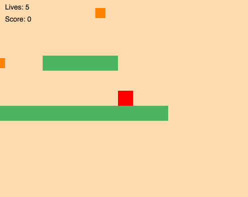
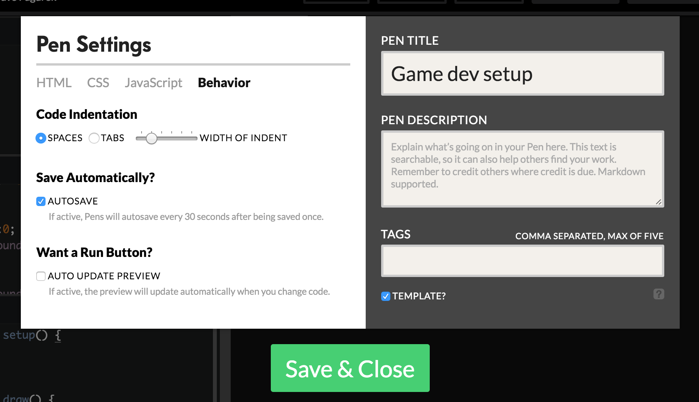

# Game Dev

## What you'll make

Playable demo: http://codepen.io/davepvm/full/PNOyrW/

## Setup

We're going to use **Codepen** to make our game. Codepen is an online code editor and community for web development technologies, which Javascript is a part of.

To be able to save and share your code, go to https://codepen.io/signup, scroll down to **Free Plan**, and sign up.

Then, come back to this page, and go to http://codepen.io/pen?template=ONJQya&editors=0010 to set up a new project with p5.js and p5.play.js added already. Additionally, there is a small amount of CSS included for you to change the page background colour.

You likely want to add a "run" button to Codepen so you don't have to reload the page each time or wait for it to automatically rerun your changed code. Click "Settings" in the top-right, go to the Behavior tab and uncheck "auto update preview" to get a run button.

## Vocabulary
- **sprite**: a graphic that we can move around the screen as a single entity
- **canvas**: the region on the screen that we can draw graphics on
- **vector**: same as in math or physics! An angle and a magnitude

## Instructions
1. <a href="part1.md">Drawing on the screen and Interactivity</a>
2. <a href="part2.md">Gravity and collision detection</a>
3. <a href="part3.md">Different kinds of blocks using Inheritance</a>
4. <a href="part4.md">Adding points and lives</a>
5. <a href="part5.md">Scrolling the camera</a>

## Next Steps
- <a href="animations.md">Change/animate the character sprite for different states</a>
- <a href="levels.md">Make multiple levels</a>
- <a href="enemies.md">Make simple enemies and make the character shoot</a>
- <a href="bosses.md">Add powerups</a>
- <a href="menus.md">Make a title screen, menu, and save progress</a>
- <a href="sound.md">Add sound</a>

## Extend it further
- Change how the game physics works as a core game mechanic. Instead of jumping, maybe the direction of gravity changes?
- Instead of manually making levels, make a game that generates random landscapes for you to explore
- Add a second character controlled by WASD
  - Make levels that can only be passed by cooperating. Maybe one character needs to stand on a button to hold a door open for the other?
  - Make a game where characters play against each other. Maybe each character has a flag at each end of the screen and the goal is to reach the other flag and bring it back to your own before the other player does?
- Add variable skill levels to your character where you can choose to spend points on upgrading different parts for different abilities
- Come up with an interesting story and non-playable characters to the game who you can talk to or interact with
