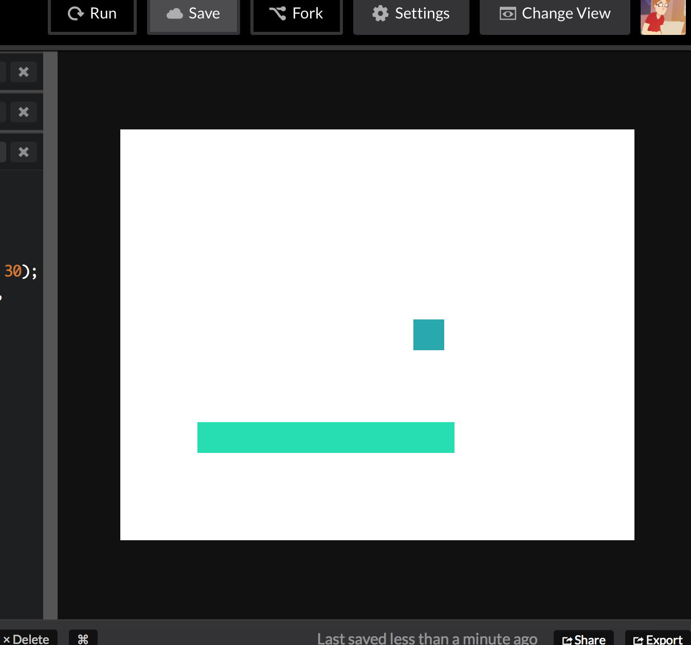

# Game Dev
## Part 1: Drawing on the Screen
<a href="README.md#instructions">Back</a>

### How do game visuals work?

In games and movies, it looks like the things on the screen on the moving. The movement you see is actually just a bunch of images with small changes played back in rapid succession, and then your brain interprets this as movement.

A classic example of this is "The Horse In Motion", which was made in 1878 by taking photos of a racehorse at different points in time. Played back, the horse appears to move.


*Frames of The Horse In Motion, from <a href="https://commons.wikimedia.org/wiki/File:The_Horse_in_Motion.jpg" target="_blank">Wikimedia</a>*


*The frames, played back, from <a href="https://en.wikipedia.org/wiki/File:Muybridge_race_horse_animated.gif" target="_blank">Wikimedia</a>*

In a game, the same thing applies. The movement in a game will be made by the computer drawing slightly different images together fast enough to give the illusion of motion. Unlike in real life, where objects move on its own for us to capture, in a game, the computer needs to figure out where to put everything in the next frame before it can draw it.

In general, a minimum **frame rate** of 18 frames per second is required for images to appear to be moving to the human brain. Games tend to run at higher rates of 30 or 60 frames per second because reaction time can be central to gameplay, making it important to have more detailed motion. This means that 60 times per second, the computer will run a program to recalculate the new positions of objects, draw an image, and display it on the screen.

### Javascript crash course

So we know we're going to have to figure out where to move each object in every update in every frame. Let's see what tools we have at our disposal!

Our game will be made in Javascript using a graphics library called p5.js. Here are the main parts of Javascript you will be using to make your game:

#### Variables
Variables **hold values**. You can assign values to them. You reference them by a name you give them. The name can be made of letters, numbers, and underscores (as long as it doesn't start with a number).
```js
// Declaring a variable
var myNumber;

// Assign a value to a variable
myNumber = 5;

// Assign a new value to the variable
myNumber = myNumber + 2;
```

You can print a variable to the console (Ctrl-Shift-J in Chrome for Windows, Command-Option-J in Chrome for Mac) to help you debug your programs:
```js
console.log("Hey there!"); // Outputs "Hey there!"

var something = 2;
console.log(something); // Outputs 2
```

There are different default types of variables you can use:
```js
var a = 2.5; // Number
var b = true // Boolean (true or false)
var c = "You have 10 lives left"; // String (a sequence of letters)
var d = [4, 6, 25, 1.5, 5, b, c, "something"]; // Array (a list of other variables)
// Object (a collection of values that each have a unique name)
var d = {
  artist: "Eminem",
  album: "Slim Shady EP",
  title: "The Real Slim Shady",
  rating: 11
};
var e = new Sprite(); // Object that is an instance of class "Sprite".
// A class is like an object that comes premade with properties and functions
// you can use. We'll talk later about making our own classes.
```

To access the first element in an array, you would write `myArray[0]` (the first element is the 0th element.) The second is `myArray[1]`. The last is `myArray[ myArray.length - 1 ]`.

To access a property in an object by its name (its key), use `myObject["key"]` or `myObject.key`.

As you can see, each statement is followed by a semicolon.

#### Conditionals
You can choose to only do something if a condition is met. In javascript, that looks like this:
```
if (condition) {
  // condition is met, do something
}

// or

if (condition) {
  // condition is met, do something
} else {
  // condition is not met, do something else
}

// or

if (condition) {
  // condition is met, do something
} else if (anotherCondition) {
  // first condition is not met but the second is
  // (you can chain as many else ifs as you want)
} else {
  // none of the above conditions are met
  // (you don't need to specify a final else if you don't want to)
}

// or
while (condition) {
  // condition is met, do something.

  // After doing something, it will check the condition again and
  // run the code in the brackets again if the condition is still
  // true. This will continue until the condition is not met when
  // it gets checked.
}
```

Condition blocks don't have semicolons after them, only the statements inside and around them do.

The condition in parentheses is a logical expression, allowing you to perform checks on variables. Here are some examples:
```js
if (x == y) {  } // Check if equal
if (x != y) {  } // Check if not equal
if (x > y) {  } // Check greater than
if (x <= y) {  } // Check less than or equal to
if (x) {  } // Check "truthiness" (if x is true or is defined and not equal to 0)
if (!x) {  } // Check "falsiness" (if x is undefined or 0)
```

You can combine multiple conditions using boolean algebra:
```js
if (conditionA && conditionB) {  } // If both are true
if (conditionA || conditionB) {  } // If either is true

// A complex example using brackets to show the precedence of expressions
if (!(conditionA || (conditionB && conditionC))) {  }
```

#### Functions
You can store repetitive code in a function to make it easier to run. When you call an expression with **arguments**, the **parameters** in the function definition will be replaced by the values and variables that were passed in. Functions can optionally **return a value** that you can assign to a variable.
```js
// a and b are parameters
//                    |
//                    v
function addNumbers(a, b) {
  return a + b;
}

// 1 and 2 are arguments
//                    |
//                    v
var sum = addNumbers(1, 2); // sum is now equal to 3
```

**IMPORTANT NOTE:** when you pass variables into a function, usually the function gets a copy of the variable. However, when you pass an object, array, or function, the function receives **the same** instance, so if you modify it, it won't only be modified inside the function.

```js
function addOne(num) {
  num = num+1;
}
var a = 5;
addOne(a);
// a is still equal to 5 since addOne received a copy of the number

function addOneToProperty(obj) {
  obj.num = obj.num+1;
}
var b = {num: 5};
addOneToProperty(b);
// watch out! b is now {num: 6}
```

You can also pass a function into another function. Some class types have methods that accept functions. For example, arrays have a method `forEach` which accepts a function and runs that function for each item in the array.
```js
var sum = 0;
var items = [1, 2, 3, 4];
items.forEach(function(item) {
  sum = sum + item;
});
// Sum is now 10
```

#### Debugging practice
To demonstrate how `forEach` works and practice debugging, let's try to fix some broken code. Here's a function that is supposed to take the average of an array of numbers. It is designed to first find the sum of the numbers and then divide by the number of items:
```js
function average(numbers) {
  var result = 0;
  var numItems = 0;
  numbers.forEach(function(n) {
    result = result + n;
    numItems = numItems + 1;
    result = result / numItems;
  });
  return result;
}

var avg = average([1, 2, 3, 4, 5]);
console.log("End result: " + avg);
```

To edit this program, go to http://codepen.io/davepvm/pen/mPqQRW?editors=0010 and open the console (Ctrl-shift-J on chrome for Windows, Cmd-option-J on Chrome for Mac). You should see this result:

```
VM1284 console_runner-ba402f0….js:1 End result: 1.275
```

Obviously, 1.275 isn't the right answer. Let's add some more logging as we go through so we can see how the program gets executed:
```js
function average(numbers) {
  console.log("Starting!");
  var result = 0;
  var numItems = 0;
  numbers.forEach(function(n) {
    console.log("Looking at item: " + n);
    result = result + n;
    console.log("Result is now " + result);
    numItems = numItems + 1;
    console.log("Numitems is now " + numItems);
    result = result / numItems;
    console.log("Result is " + result + " after dividing");
  });
  return result;
}
```

After we run this, we can see more logs (at any time, you can press the circle with a line through it to clear the console):
```
VM1284 console_runner-ba402f0….js:1 Starting!
VM1284 console_runner-ba402f0….js:1 Looking at item: 1
VM1284 console_runner-ba402f0….js:1 Result is now 1
VM1284 console_runner-ba402f0….js:1 Numitems is now 1
VM1284 console_runner-ba402f0….js:1 Result is 1 after dividing
VM1284 console_runner-ba402f0….js:1 Looking at item: 2
VM1284 console_runner-ba402f0….js:1 Result is now 3
VM1284 console_runner-ba402f0….js:1 Numitems is now 2
VM1284 console_runner-ba402f0….js:1 Result is 1.5 after dividing
VM1284 console_runner-ba402f0….js:1 Looking at item: 3
VM1284 console_runner-ba402f0….js:1 Result is now 4.5
VM1284 console_runner-ba402f0….js:1 Numitems is now 3
VM1284 console_runner-ba402f0….js:1 Result is 1.5 after dividing
VM1284 console_runner-ba402f0….js:1 Looking at item: 4
VM1284 console_runner-ba402f0….js:1 Result is now 5.5
VM1284 console_runner-ba402f0….js:1 Numitems is now 4
VM1284 console_runner-ba402f0….js:1 Result is 1.375 after dividing
VM1284 console_runner-ba402f0….js:1 Looking at item: 5
VM1284 console_runner-ba402f0….js:1 Result is now 6.375
VM1284 console_runner-ba402f0….js:1 Numitems is now 5
VM1284 console_runner-ba402f0….js:1 Result is 1.275 after dividing
VM1284 console_runner-ba402f0….js:1 End result: 1.275
```

Now we see the problem, we're dividing by the number of items in every iteration of the loop instead of once at the end. Try moving the division to the end:
```js
function average(numbers) {
  console.log("Starting!");
  var result = 0;
  var numItems = 0;
  numbers.forEach(function(n) {
    console.log("Looking at item: " + n);
    result = result + n;
    console.log("Result is now " + result);
    numItems = numItems + 1;
    console.log("Numitems is now " + numItems);
  });
  result = result / numItems;
  console.log("Result is " + result + " after dividing");
  return result;
}
```

Here's the new result:
```
VM1284 console_runner-ba402f0….js:1 Starting!
VM1284 console_runner-ba402f0….js:1 Looking at item: 1
VM1284 console_runner-ba402f0….js:1 Result is now 1
VM1284 console_runner-ba402f0….js:1 Numitems is now 1
VM1284 console_runner-ba402f0….js:1 Looking at item: 2
VM1284 console_runner-ba402f0….js:1 Result is now 3
VM1284 console_runner-ba402f0….js:1 Numitems is now 2
VM1284 console_runner-ba402f0….js:1 Looking at item: 3
VM1284 console_runner-ba402f0….js:1 Result is now 6
VM1284 console_runner-ba402f0….js:1 Numitems is now 3
VM1284 console_runner-ba402f0….js:1 Looking at item: 4
VM1284 console_runner-ba402f0….js:1 Result is now 10
VM1284 console_runner-ba402f0….js:1 Numitems is now 4
VM1284 console_runner-ba402f0….js:1 Looking at item: 5
VM1284 console_runner-ba402f0….js:1 Result is now 15
VM1284 console_runner-ba402f0….js:1 Numitems is now 5
VM1284 console_runner-ba402f0….js:1 Result is 3 after dividing
VM1284 console_runner-ba402f0….js:1 Sum: 3
```
There we go, now we get the righ answer! You can take out the `console.log`s out now.

Now we're ready to start making our game!

### Setting up our game's visuals

In your Javascript editor, we will set up our game in the following structure:

```js
// Declare variables

function setup() {
  // Assign to variables

  // Set up initial state
}

function draw() {
  // Calculate new positions of objects

  // Accept user input (keypresses, etc)

  // Redraw screen
}
```

In p5.js, everything happens inside the two functions `setup` and `draw`. p5.js looks specifically for these, so their names can't be changed. `setup()` is called once at the beginning when all of the javascript is loaded and ready to go, and `draw()` is called every frame of the game.

We want to declare our variables **outside** of the functions so that both functions can "see" them and access them. We only want to assign values to the variables in `setup` though, because we only know for sure that everything has been loaded once `setup` gets run.

Inside `setup`, we can define the size of the canvas with `createCanvas(width, height)`. A decent starting size might be something like 500 pixels by 400 pixels. (Note: if you have a retina display, one "pixel" might be more than one physical pixel in reality because your browser keeps the size of a "pixel" consistent across devices.)

So, how do we add some objects into the game?

Objects in the game are called **Sprites**. Assuming you declared a variable called `myObject`, you might assign a Sprite instance to it like this:
```js
myObject = createSprite(x, y, width, height);
```

To specify where on the screen an object will be rendered, we refer to its location in x and y coordinates, where `x == 0` on the left side of the canvas, `x == width` on the right, `y == 0` at the top, and `y == height` at the bottom. For those familiar with Cartesian planes from math class, this isn't quite what you're used to, since the y values get more positive as you go down instead of the getting more negative. The x and y coordinates specified when creating a sprite will be the **center of the sprite.**

In `draw`, we can call `drawSprites()` to render the sprites we made to the screen.

Let's start by adding some ground (a long rectangle) and a character to represent the player (a smaller rectangle on top of the ground) as onto the screen.

```js
var player;
var ground;
function setup() {
  createCanvas(500, 400);
  player = createSprite(300, 200, 30, 30);
  ground = createSprite(200, 300, 250, 30);
}

function draw() {
  drawSprites();
}
```

When you press **Run** in the toolbar on Codepen, you should see your sprites render!


You'll notice that every time you hit Run, the colours change. p5.js picks random colours for you if none are specified, so let's specify our own. The canvas can be coloured with `background(red, green, blue)` and sprite colours can be changed with `sprite.shapeColor = color(red, green, blue)`. The parameters `red`, `green`, `blue` are integers from 0 to 255 that specify how much light of each component colour should be mixed to create the overall colour. You might find <a href="http://www.colorpicker.com" target="_blank">colorpicker.com</a> useful for finding RGB values to put in these. 


```js
var player;
var ground;
function setup() {
  createCanvas(500, 400);
  player = createSprite(300, 200, 30, 30);
  player.shapeColor = color(255, 0, 0);
  ground = createSprite(200, 300, 250, 30);
  ground.shapeColor = color(80, 180, 100);
}

function draw() {
  background(255, 220, 180);
  drawSprites();
}
```


We need to assign a sprite's `shapeColor` only once in `setup`, since it will get rendered every frame with `drawSprites()` in the `draw` function. However, `background(red, green, blue)` simply draws over the screen with a colour, so we will want to run this every frame.

The order you draw matters! If you want the sprites to appear, you need to draw them after first drawing the background since `background` draws over everything.

### Interactivity and motion

Next, let's add some interactivity and movement.

We initialized each sprite with a location, and this location is accessible through `sprite.position.x` and `sprite.position.y`. If we wanted to make the sprite move every frame, we could update the coordinates of the sprite each frame with something like `sprite.position.x += 5;`, but there is a better way.

The sprite has a **velocity** vector, which we can set **once**, and the sprite will automatically add it to its position each frame. We can set it like `sprite.velocity = createVector(x, y)` or by assigning number values to `sprite.velocity.x` and `sprite.velocity.y`. Try setting an initial velocity for your character and watch it fly offscreen!

```js
player.velocity = createVector(0, 3);
```

You can rerun your code or reload the page (after saving!) to reset the game's state. Let's make this be triggered by a keypress instead of all the time. Inside the `draw` function, we have access to two kinds of key press listeners we can use to change the positions of the objects before we draw them:
- `keyDown(key)`: This will return true if the key is currently down on a given frame.
- `keyWentDown(key)`: This will only return true if the key went down on the current frame, and will be false if the key is down but has been held from a previous frame.

Let's make our character move when arrow keys are pressed. When a direction key such as `'RIGHT_ARROW'` is down, set the character's velocity, else if another direction is pressed, set a different velocity, else reset the horizontal velocity to zero. When the up arrow first goes down, we can set a negative value for the vertical velocity to simulate jumping.

In the code describing the order in which we will do our calculations, I put the section for accepting user input after calculating the other positions of objects. It doesn't make a difference yet, but we want to do this anyway because later on when we are doing collision detection, we will want to have logic that depends on positions already being calculated. For example, when the up arrow is pressed, we will only want to let the player jump if they are currently on the ground, which we need to have calculated beforehand.

```diff
function draw() {
  background(255, 220, 180);
 
  if (keyDown('RIGHT_ARROW')) {
    player.velocity.x = 4;
  } else if (keyDown('LEFT_ARROW')) {
    player.velocity.x = -4;
  } else {
    player.velocity.x = 0;
  }
  
  if (keyWentDown('UP_ARROW')) {
    player.velocity.y = -6;
  }
  
  drawSprites();
}
```

Now you should be able to move left and right, and fly up in the air when hitting the up key. There's no gravity yet, we're going to do that next! You can rerun the javascript or save and reload the page to reset the game.

<a href="https://github.com/molleindustria/p5.play/blob/965e2fc5af0335f0abd6ca362ca70dc205c8f40c/lib/p5.play.js#L502-L593" target="_blank">Here is a list of possible values for the `key` parameter</a> in case you want to attach events to different kinds of key presses.

### What you should have so far
Here's a link to a Codepen project completed up to this step, in case you fall behind: http://codepen.io/davepvm/pen/NNWyrV?&editors=0010

<a href="part2.md">Part 2: Gravity and collision detection</a>

<a href="README.md#instructions">Back</a>
