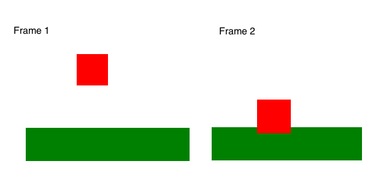
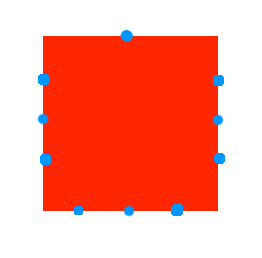

# Game Dev
## Part 2: Gravity and collision detection
<a href="README.md#instructions">Back</a>

### Creating gravity

If you remember from physics class, on the earth, gravity accelerates all objects towards the center of the planet at the same rate (approximately 9.81 meters per second squared, depending on your altitude and location.) If you look at the units, this means that every second, the velocity of an object under Earth's gravity will increase by 9.81 meters per second.

In general, `velocity := acceleration * time` (where `:=` means "is defined as"; this is not valid Javascript.) To simulate this, in our game, we're going to define a gravity vector, and every frame, we are going to add this vector to the player's velocity vector.

Adding to the velocity vector of a sprite can be done with `sprite.velocity.add(anotherVector);`.

### Checking for collisions

In the game's current state, there is nothing actually stopping the player from simply falling through the ground. Every frame, after calculating new positions and before accepting user input, we will run a **collision detection check**. Seeing if two sprites are touching is simple. In our game setup, we will make two **sprite groups**, one for objects that have physics and can move around, and one for solid objects that can be collided with. Then in the draw loop, we can use a group's `overlap` function:

```js
// In setup:
group1 = new Group();
group1.add(someSprite);

// In draw loop:
group1.overlap(group2, function(a, b) {
  // In this function, "a" is the first sprite, and "b" is the second
  // that are overlapping as opposed to the entire group. The function
  // will get run for every set of overlapping sprites and won't be
  // called for sets that don't overlap.
})
```

The hard part is that simply knowing that there is an overlap isn't enough. We want to know specifically what parts are overlapping. Here's why:
- There is a difference in our game's logic between touching a wall and touching the ground. In each case, a different component of the player's velocity vector needs to change.
- Because we move the player in frames, in one frame the player might not be touching anything, and in the next frame the character might be *inside* the ground and will need to be moved out.



*Part of collision detection is pushing objects out of solid objects.*

There are multiple ways to do this, but we are going to see if individual points are touching instead of just the whole rectangle. We'll check two points on each side of the rectangle:



This isn't perfect, but it's reasonably efficient and works well. So, to keep track of who's touching whom, before we check collisions, we'll make an object on each sprite to store what sides the player is being touched on, and we will update it inside the collision detection function.

```js
// Set initial touching state
group1.forEach(function(sprite) {
  sprite.touching = {left: false, right: false, top: false, bottom: false};
})

// Check collisions and update touching state
group1.overlap(group2, function(a, b) {
  // if a is touching b on the left:
  //   a.touching.left = true;
  //   Also move a out of b so they are no longer overlapping
});

// Check user interaction, and now we can check if aprite.touching.bottom
// is true or something like that

```
