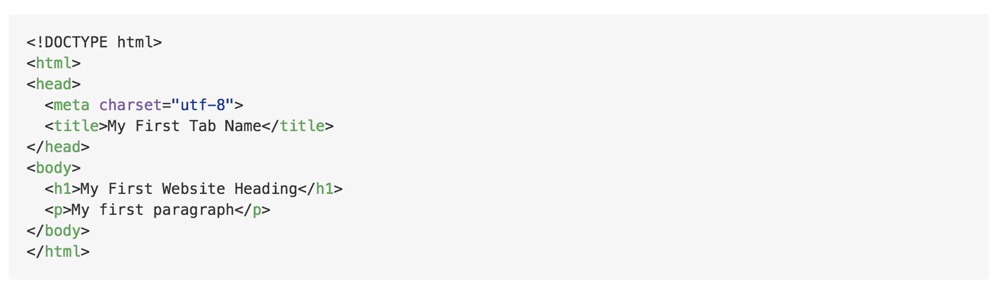

## Hello, World (Wide Web)

Long, long ago, when the great Tim-Berners Lee brought us the WWW, websites were documents that lived on some machine somewhere. Those documents had names called URLs by which anyone from anywhere across the world could request the document. The machine that hosted those documents would then 'serve' the document over the Internet to the person that had requested it.

This anyone from anywhere across the world was called the `client`,
and the some machine somewhere that serves web resources like documents is known as the `server`.

<!-- Model
View
Controller -->

And that brings us to...

## Your First Website

Create a folder on your computer for all your files to go inside.
In Atom, create a new untitled file (File > New File) and save it as "index.html" in the folder you just created.

Inside `index.html`, type:

```html
<!DOCTYPE html>
<html>
<head>
  <meta charset="utf-8">
  <title>My First Tab Name</title>
</head>
<body>
  <h1>My First Website Heading</h1>
  <p>My first paragraph</p>
</body>
</html>
```

Now go to Documents (Windows) / Finder (Mac) > "Open `index.html` in Chrome".

You should see your very first website!

## Welcome to HTML
HTML, or Hypertext Markup Language, defines the basic structure and content of every website.

### Basic structure of an HTML Document
<!--  -->


### &lt;h2&gt;Elements, Tags, and Attributes&lt;/h2&gt;

To define the structure of a website, HTML uses tags:
```html
<some-tag>stuff that goes inside</some-tag>
```
This is an HTML element.

HTML follows grammar rules, which in programming we call `syntax` rules.
Tags pretty much always occur in pairs: an opening tag followed by a closing tag. (Except `<br>`, which is a line break.)
We'll see shortly that tags can be "nested" inside one another to contain each other.

Aside from the tags shown here, we also have `div`. A `div` element is used as an all-purpose container.
Let's list a couple projects!
Add the following below the line for your first paragraph:
```html
<div class="project">
  <h2>Project 1</h2>
  <p>My First Website</p>
</div>
<div class="project">
  <h2>Project 2</h2>
  <p>My Second Website</p>
</div>
<div class="project">
  <h2>Project 3</h2>
  <p>My Third Website</p>
</div>
```
Notice the new `class="project"`.

HTML elements can have `attributes` to describe them. Each attribute consists of a `name` and a `value`.
For example, "class" is an attribute with name "class" and its value in the HTML elements we just defined is "project".
The `class` attribute lets us group related elements together so we can do the same things on all of them.

The `id` attribute is used to name a unique element.

Here's what your HTML file should look like now: [html file](html_snapshot_0.html)

## CSS Beauty Makeover

Create a new file "File > New File" and name it "styles.css". Save it in the same folder as "index.html".

Inside the new file, put:
```css
body {
  font-family: "Helvetica";
}

h1 {
  color: blue;
  font-size: 40pt;
}

.project {
  background-color: orange;
}
```

Now tell the HTML file to use your new CSS file by updating the head to this:
```html
<head>
  <meta charset="utf-8">
  <title>My First Tab Name</title>
  <link rel="stylesheet" href="styles.css">
</head>
```

Refresh the page! You should see a slightly more colorful webpage now.

### Language #2: CSS
CSS stands for Cascading Style Sheets. CSS files are what set the appearance of a website, from the font color of the text to the positions of each element.

Now let's get into the real makeover.

### We Never Go Out Of Style
<!-- Replace the previous code with this: -->
Take a look at this final CSS file:

```css

body {
  font-family: "Montserrat";
}

.post p {
  font-family: "Open Sans";
  /*font-weight: 300;*/
}

/*img {
  height: 700px;
  width: 500px;
}*/

/*h1 {
  color: #006AFF;
  color: white;
}*/

.navbar {
  /*background-color: rgba(255, 255, 255, 0.1);*/
  padding: 5px;
  /*#C2EAFF;*/
  height: 20px;
  width: 70%;
  margin: 0 auto 40px auto;
}

.navbar ul {
  margin: 0;
}

.navbar ul li {
  padding: 2px 3px;
  margin: 0 30px 0 0;
  /*change to nav not .navbar*/
  display: list-item;
  list-style-type: none;
  float: left;
}

#current {
    /*border: solid 1px #006AFF;
    border-radius: 4px;*/
    border-bottom: solid 2px white;
}

.navbar ul li a {
  /*color: #006AFF;*/
  color: white;
  float: left;
}

.navbar ul {
  padding: 0px;
  /*display: list-item;*/
  /*list-style-type: none;*/
}

.navbar li {
 float: left;
 margin: 0 10px 0 0;
}

.navbar ul li a {
  text-decoration: none;
}

.project {
  opacity: 1;
  transition: all 0.1s;
  border: solid 1px white;
  border-radius: 10px;
  padding: 0 10px;
  margin: 3px 3px;
  width: 30%;
  min-width: 150px;
  float: left;
  min-height: 125px;
  position:relative;
}

.project:hover {
  background-color: rgba(255, 255, 255, 0.2);
  transition: background-color 0.1s;
}

/*Better solution to clickable div http://jsfiddle.net/hf75B/1/*/
.link-spanner{
  position:absolute;
  width:100%;
  height:100%;
  top:0;
  left: 0;
  z-index: 1;
}

.fading {
  opacity: 0;
  border: solid 1px white;
  border-radius: 10px;
  padding: 0 10px;
  margin: 3px 3px;
  width: 30%;
  min-width: 150px;
  float: left;
}

#container {
  margin: auto;
  width: 70%;
  position: relative;
}

.add {
  position: absolute;
  right: 0px;
  font-size: 15pt;
  z-index: 2;
  /*background: none;
  border: none;*/
}

#title {
  padding: 100px;
  text-align: center;
  /*text-transform: uppercase;*/
  font-family: "Montserrat";
  font-size: 40pt;
}
/*
#footer {
  position: fixed;
  bottom: 0;
  width: 100%;
  height: 700px;
}*/

/*.add:active {
  color: blue;
}*/

.list-hover-slide>li {
    position: relative;
    overflow: hidden;
}
.list-hover-slide>li>a {
    z-index: 1;
    transition: .35s ease color;
}
.list-hover-slide>li>a:before, .list-hover-slide>li.dropdown.open>a:before {
    content:'';
    display: block;
    z-index: -1;
    position: absolute;
    left: 0;
    top: 0;
    right: 0;
    bottom: 0;
    transform: translateX(-100%);
    border-right: solid 5px tomato;
    background: gray;
    transition: .35s ease transform;
}
.list-hover-slide>li>a:hover:before, .list-hover-slide>li.dropdown.open>a:before {
    transform: translateX(0);
}
.list-hover-slide>li.dropdown.open {
    overflow: initial;
}

body {
  width: 100%;
  color: white;
  background-color: #303030;
  background-image: url("image.jpg");
  /*background-image: url("http://kriswhitewrites.com/wp-content/uploads/2013/06/landscape-mountains-snow-sky.jpg");*/
  /*background-size: cover;*/
  background-size: 100% 800px;
  background-repeat: no-repeat;
}

.post {
  background-color: white;
  color: #5E5E5E;
  border-radius: 20px;
  padding: 20px;
  margin-bottom: 40px;
}

 .post h1 {
   text-align: center;
   /*color: gray;*/
 }

 a {
  color: inherit; /* blue colors for links too */
  text-decoration: inherit; /* no underline */
}

input, textarea {
  border: solid 1px #CCCCCC;
  margin-bottom: 15px;
  font-family: "Montserrat";
  /*background-color: gray;*/
}

textarea {
  width: 100%;
  box-sizing: border-box;
}

#thread .poster:after {
  content: " said:";
  font-family: "Open Sans";
  font-weight: 300;
}

#thread .comment {
  margin-bottom: 30px;
}

#thread .poster {
  margin-bottom: 10px;
  color: gray;
}

#thread .comment-text {
  border-left: solid 3px tomato;
  color: #5E5E5E;
  padding-left: 15px;
}

.like img {
  /*background-image: url("heart-green.svg");*/
  width: 20px;
  height: 20px;
  display: inline;
}

.like {
  /*width: 40px;*/
  /*position: relative;*/
  display: inline;
  float: right;
}

.like p {
  display: inline;
  vertical-align: top;
  padding-left: 5px;
  line-height: 20px;
  color: gray;
}

``
[TODO: update this css file]

### Selectors
In the previous file:
- .<something> selects all elements with class "something"
- \#<something> selects the element with id "something"
- <something> selects all elements with tag "something"
- <some selector> <another selector> selects all elements matching "another selector" that are __descendants__ of an element matching "some selector"
- <some selector> __>__ <another selector> selects all elements matching "another selector" that are __immediate children__ of an element matching "some selector" [(see relevant Stack Overflow answer)](http://stackoverflow.com/a/746557/5391146)
(You can check out http://flukeout.github.io/ for a fun CSS primer!)

For now, replace the previous CSS code with this:
```css
body {
  font-family: "Montserrat";
}

.post p {
  font-family: "Open Sans";
}
```

You'll need to add two more lines to your HTML head in order to use the fonts "Montserrat" and "Open Sans", so that the head looks like this:
[TODO: should it be in head?]
```html
<link href='https://fonts.googleapis.com/css?family=Montserrat' rel='stylesheet' type='text/css'>
<link href='https://fonts.googleapis.com/css?family=Open+Sans:400,300' rel='stylesheet' type='text/css'>
```
These were found using [Google Fonts](https://www.google.com/fonts).

Change up the text in your HTML elements to fit the website, too.

Let's add a background image!
Set the background image for `body` using
```
  background-image: url("http://kriswhitewrites.com/wp-content/uploads/2013/06/landscape-mountains-snow-sky.jpg");
```
Now make all the font white. (Hint: use the "color" attribute and "body" selector.)

Using the above file as a reference, modify your current CSS file.
[Here's an example updated CSS file.](css_snapshot_1.css)

## Adding interactivity with Javascript (not Java!)

Javascript is a programming language that's recently taken the developer world by storm (There's Angular JS, Node JS, React JS, Meteor JS, Ember, Backbone, ... the list goes on).

<TODO: insert more about Javascript>

Here, we're going to use Javascript to make a clickable button for adding new projects.
Create a third file called "scripts.js".


### Manipulating the DOM

Of course, the world isn't powered by many code monkeys modifying the HTML every time someone adds a new comment or post.

<More about the Document Object Model>

Computer scientists and programmers are fanciful people. The Document Object Model is one example of a `tree` of `nodes`. A node can be a `root`. Otherwise, it has ancestors, and specifically, `parents`. A node can also have `children`, unless it's a `leaf`.

You can modify the DOM tree `dynamically` with the web's favourite language - Javascript - using methods named after the terms we just described, like `.appendChild`. [edit]

`.createElement`
`.appendChild`
`.getElementById`
`.getElementsByClass`
etc.

Remember this keyword, `dynamic`, especially when searching StackOverflow - eg. "jQuery on click event not working for dynamically created items".

<!-- ### JQuery

Adding new elements was messy. There's a more convenient way to do all this:

```js

``` -->

## Fleshing out the website

Let's start filling in the content.

__Task 2:__ Turn each of the project divs into a clickable link to an HTML template titled `project_<project number>.html` (eg. "project_1.html").

__Task 2.5:__ the Navbar and About page

__Task 3:__ Your turn now: Fill in `project_1.html`!

## The Comment Thread

Every good post has a place for its audience to discuss the post. [edit: rephrase]

Whether it's a contact form so loving employers can drop you a line or a submission form for content, HTML has an element just for forms: <form></form>. [edit: rephrase]

Example usage:
```html
<form class="" id="comment-form" action="" method="post">
  <label for="name">Name</label>
  <br>
  <input type="text" name="name" id="name" value=""/>
  <br>
  <label for="comment">Comment</label>
  <br>
  <textarea name="comment" id="textarea" rows="8" cols="40">comment here</textarea>
  <!-- <input type="text" name="comment" value=""/> -->
  <input type="submit" name="submit-comment" id="submit-comment" value="Comment"/>
</form>
```
(edit: maybe don't give the exact code)

__Task 4:__ Now edit the `script.js` file. Manipulate the DOM so that Internet users can add comments to your site dynamically.
To do this, you'll want to write the functions `addComment`, and `bind` the `submit` action for the `#comment-form` to code that calls `addComment`.
You can get the values stored in the HTML form's `fields` with `<object>.val()`.
Remember that JQuery provides convenient selectors, so if your HTML input element has the id `#foo`, you can get its value with `$("#foo").val()`.

### Good form (no pun intended)

Here's an example final implementation:
```javascript
$("#comment-form").on("submit", function(e) {
  e.preventDefault();
  var name = $("#name").val();
  $("#name").val("");
  var comment = $("#textarea").val();
  $("#textarea").val("comment here");
  if(validate(name) && validate(comment))
    addComment(name, comment);
});
```

Notice the additional function `validate`. This is important!
Source: relevant xkcd comic. (little bobby tables)

Try this: put the below input into the comment field (you can just leave the name field blank)
```javascript
TODO!
fill_me_in()
```

Real-life production code should never allow this, or else users could ~~take advantage of this security flaw to~~ run malicious scripts.

### Animations and Effects with HTML and CSS and Javascript and JQuery


## Sorry

When you reload your page, all the comments disappear. All the posts you added disappear. Not even Ctrl+S can _save_ you.

Unfortunately, this is the end for My First Website 2.0.

What we're missing is a `database`. This is a persistent storage that lives elsewhere. Every time someone creates a new comment or post, this information is stored in the database and loaded up again when a user loads the website.

Web apps really have three layers:

- the presentation layer
- the

[edit below section]
You could use PHP, which is a `server-side` `scripting` language. But goal #2 of this learnathon is to get you started with web development in 2016, and introduce you to web frameworks.

And anyway,

This is why developers use `web frameworks`, like Django, Ruby on Rails, Flask,

## Recap

HTML
CSS
Javascript

## Onto Flask!
